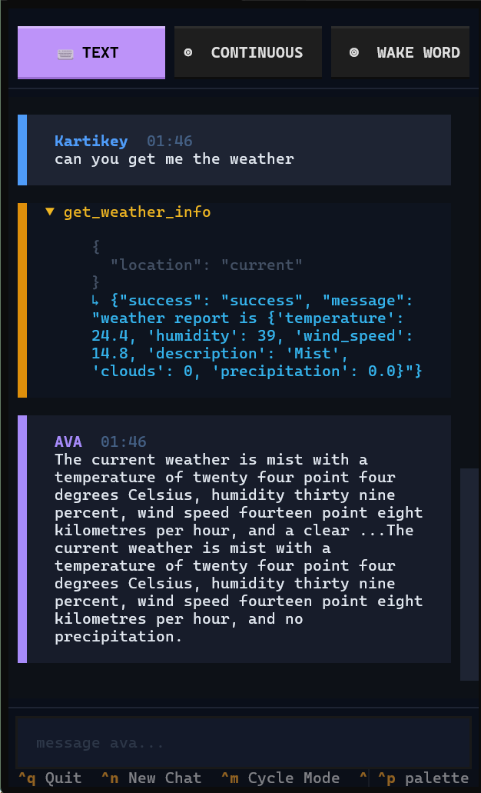

<div align="center">
<pre>
 _____ ___  _______   
\__  \\  \/ /\__  \  
 / __ \\   /  / __ \_
(____  /\_/  (____  /
     \/           \/ 
</pre>

# 🌌 A.V.A: Always Voiced Ally
### *The Next Generation of Personal Neural Intelligence*

[]()
[]()
[]()

---

</div>

## 💠 SYNOPSIS
**A.V.A** is a hyper-responsive, modular neural assistant designed to bridge the gap between human intuition and machine precision. Orchestrated via a sophisticated **Client-Server Neural Link**, it offloads cognitive load to a high-performance backend while maintaining a sleek, low-latency interface on your local hardware.

---

## ⚡ CORE MODULES

<table align="center">
  <tr>
    <td align="center"><b>🛰️ NEURAL LINK (SERVER)</b></td>
    <td align="center"><b>🖥️ INTERFACE (CLIENT)</b></td>
  </tr>
  <tr>
    <td>
      <ul>
        <li><b>LLM Core:</b> Driven by <i>Kimi-k2-instruct</i> for high-context logic.</li>
        <li><b>Memory Matrix:</b> Persistent semantic storage for long-term recall.</li>
        <li><b>Neural Synthesis:</b> High-speed <i>Piper TTS</i> backend.</li>
      </ul>
    </td>
    <td>
      <ul>
        <li><b>Cyber-TUI:</b> Ultra-modern terminal interface with live logs.</li>
        <li><b>Hybrid STT:</b> Vosk (Local) + Groq Whisper (Accurate).</li>
        <li><b>Tool Orchestrator:</b> Local execution of system & web tools.</li>
      </ul>
    </td>
  </tr>
</table>

---

## 🖥️ VISUAL INTERFACE

<div align="center">
  
  <br>
  <i>— TUI Neural Conversation Flow —</i>
</div>

Explore a beautifully crafted terminal experience featuring live markdown rendering, real-time tool logs, and a sleek modern aesthetic.

---

## 🛠️ CYBERNETIC CAPABILITIES

### 🧬 Persistent Semantic Memory
Unlike standard assistants, A.V.A builds a **Neural Profile** of you. It extracts key data points from your conversations and stores them in a semantic database, evolving with every interaction.

### 🌓 Hybrid Audio Pipeline
* **Zero-Latency Monitoring:** Local Vosk engine monitors ambient audio for wake-words.
* **Whisper Precision:** Groq's Whisper-v3-turbo handles final transcription with unparalleled accuracy.

### 🌐 Universal Tool Integration
* **🏠 Dominion Control:** Native integration for <b>WiZ Smart Lights</b>.
* **🌐 Data Extraction:** High-speed web scraping and Google AI fallback search.
* **🧬 Code Sandbox:** Safe, isolated Python execution environment for dynamic calculations.
* **📄 Neural Documentation:** MD-to-PDF generation and secure workspace management.

---

## 🚀 INITIALIZATION

### 1️⃣ Neural Configuration (`settings.json`)
Configure your access tokens in the root and server directories.

**Root Configuration:**
```json
{
  "GROQ_API_KEY": "GSK_...",
  "USER_NAME": "Cyber_User",
  "ASSISTANT_NAME": "AVA",
  "AVA_SERVER_URL": "http://127.0.0.1:8765"
}
```

### 2️⃣ System Deployment
```bash
# Install Neural Dependencies
pip install -r requirements.txt

# Initialize Web Browsing Subsystems
playwright install
```

---

## 📡 OPERATIONAL MODES

| MODE | DESCRIPTION |
| :--- | :--- |
| **`tui`** | Full GUI-like Terminal Interface with live telemetry. |
| **`continuous`** | Seamless background listening with automatic transcription. |
| **`wakeword`** | Power-efficient monitoring for "Hey AVA" activation. |
| **`text`** | Direct neural link via keyboard (bypass audio). |

---

## 📟 SYSTEM COMMANDS
* **`python -m Server`** — Initialize the Neural Backend.
* **`python App/__main__.py`** — Establish the Neural Link (Client).
* **`Ctrl+C`** — Pulse Emergency Shutdown.

---

<div align="center">
  <p><i>"Bringing the future of human-machine interaction into the present terminal."</i></p>
  <sub>Built by <b>Antigravity</b> for the next frontier.</sub>
</div>
